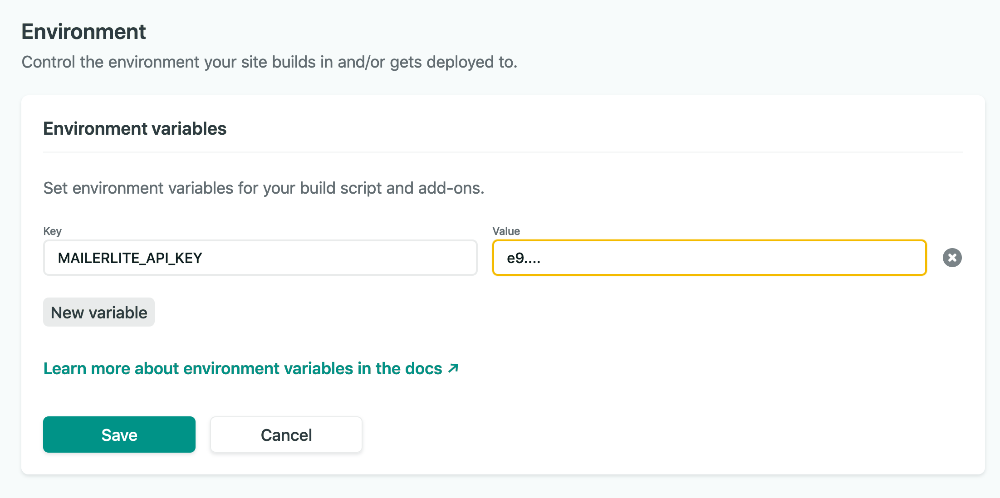
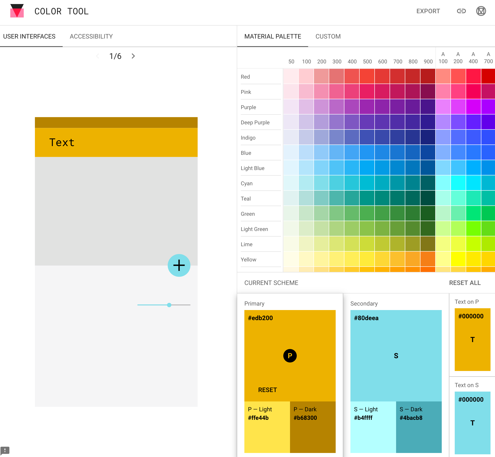

# Capitalgram website source code

This is a corporate website and blog for [Capitalgram.com](capitalgram.com/)

- [Capitalgram website source code](#capitalgram-website-source-code)
- [Features](#features)
- [How to develop](#how-to-develop)
  * [Getting Started](#getting-started)
    + [1. Clone this Repository](#1-clone-this-repository)
    + [2. Navigate to the directory](#2-navigate-to-the-directory)
    + [3. Install dependencies](#3-install-dependencies)
    + [4. Run Eleventy with Netlify helper](#4-run-eleventy-with-netlify-helper)
  * [Testing MailerLite client](#testing-mailerlite-client)
  * [Testing Netlify server-side functions](#testing-netlify-server-side-functions)
  * [Image processing pipeline](#image-processing-pipeline)
  * [Table of contents](#table-of-contents)
  * [Social media sharing headers and images](#social-media-sharing-headers-and-images)
- [Deploying in production on Netlify](#deploying-in-production-on-netlify)
- [Lessons learned](#lessons-learned)
- [Links](#links)
  * [Netlify](#netlify)
  * [Logo](#logo)
  * [Fonts](#fonts)
  * [Colors](#colors)
  * [Photos](#photos)
  * [Bootstrap and theming links](#bootstrap-and-theming-links)
  * [Push](#push)
  * [Social media share debuggers and port forwarding](#social-media-share-debuggers-and-port-forwarding)
  * [Other good Eleventy sites](#other-good-eleventy-sites)


# Features 

* Based on [Eleventy framework](https://www.11ty.dev/)

* A landing page, content pages and blog posts

* Netlify hosting (free)

* MailerLite newsletter sign up integration using Netlify serverless functions

* Theme based on [Material Design for Boostrap](https://mdbootstrap.com/freebies/jquery/blog/), uses [Wow.js](https://wowjs.uk/) for reveal animations

* Media tags and images for Google search, Google news, Facebook sharing and Twitter sharing

* Google Sitemaps support 

* RSS feed 

* Clean source tree by using  [Node.js module aliases](https://www.npmjs.com/package/module-alias) to create a `@capitalgram` namespace

* Image optimisations and `<picture>` size sets with [Gulp based pipepline](https://github.com/idiazroncero/eleventy-netlify-cms) (ripped out from eleventy-netlify-cms)

* [Table of Content generation for pages and posts](https://afeld.github.io/bootstrap-toc/)

# How to develop

As the site is very company-specific content, you mostly benefit about this repository
as an example for your own Eleventy based site.

Here are the instructions for running the project locally.

The project has been only built on OSX, though Windows should work in theory.

## Getting Started

### 1. Clone this Repository

### 2. Navigate to the directory

### 3. Install dependencies

```
npm install
```

### 4. Run Eleventy with Netlify helper

```
npx netlify dev
```

Or build and host locally for local development
```
npx eleventy --build
```

Or build automatically when a template changes:
```
npx eleventy --watch
```

Or in debug mode:
```
npx debug
```

## Testing MailerLite client

A small JavaScript lib is included to interact with MailerLite from Netlify server-side functions.

To test, write your MailerLite API key in a file called `mailerlite-apikey.txt` that is Gitignored.

Then run.

```sh
npm run test-mailerlite
```

## Testing Netlify server-side functions

To run server-side functions locally, write down the api key in gitignored `secrets/mailerlite-api-key.txt`.
Then you can export it as following:

```sh
export MAILERLITE_API_KEY=`cat secrets/mailerlite-api-key.txt`
npx netlify dev
```    

Then you can go directly to a function URL with your browser:

http://localhost:8888/api/newsletter

This should give you the reply

```
Method Not Allowed for newsletter subscriber
```

Test subscription with cURL:

```sh
curl --header "Content-Type: application/json" \
  --request POST \
  --data '{"email":"foo@bar.com"}' \
  http://localhost:8888/api/newsletter
```  

Then you can proceed to try to do the newsletter subscription with a browser, on the webserver,
from the subscription form in the footer.

[More information about Netlify dev server](https://github.com/netlify/cli/blob/master/docs/netlify-dev.md#netlify-functions)

## Image processing pipeline

You can manually process images locally.

* It reads `static/img/content` images

* It produces `_site/img/content/dist` images

* In `src/filters` I have added template filters to nicely access these images in post headers and post content

To run processing manually:

```
npm run images:resize 
```

This is also run part of 

## Table of contents

Table of Contents is generated in-fly from the page content by JavaScript. You need to place a marker element where you want the table of contents to appear.

```html
<h2 data-toc-skip>Table of contents</h2>

<ol id="toc"><!-- --></ol>
```

## Social media sharing headers and images

See `social.js` for default sharing tags and images. Pages and posts can provide their own tags.

Change Facebook image on an individual page:

```
---
title: Foobar
page_logo: /static/img/header-services.jpg
---
```

Add Facebook, Twitter, Google image and author information to your post:

```
author: Mikko Ohtamaa
date: 2020-02-01
page_logo: /static/img/content/src/world-squares.png
page_facebook_type: article 
page_twitter_creator: moo9000

```

For more information see [social.js](https://github.com/miohtama/capitalgram/blob/master/src/config/social.js) and [social_media_header.njk](https://github.com/miohtama/capitalgram/blob/master/templates/partials/social_media_header.njk).

### Social media share debuggers and port forwarding

I tried

- ngrok: Dashboard was down

- serveo: Did not connect

- PageKit: banned by Facebook

Eventually, I had to revert to DigitalOcean VM and SSH port forward.

[Enable GatewayPorts](https://www.ssh.com/ssh/tunneling/example#remote-forwarding) in `/etc/ssh/sshd_config`.

Then forward the port 8888 from your DigitalOcean droplet to your local dev machine:

```
ssh -vv -R8888:localhost:8888 root@mydroplet.com
```

# Deploying in production on Netlify

* Toggle all optimisation options in Netlify's *Postprocessing* so you do not need to minify JS, CSS and images by hand

* Set environment variable for MailerLite API key



# Lessons learned 

* The used [MDB - Material Design for Bootstrap](https://mdbootstrap.com/freebies/jquery/blog/) stylesheets are not that high quality - a lot of `!important` statements. Next time I will go with alternative [Material Design for Boostrap](https://fezvrasta.github.io/bootstrap-material-design/)

# Links

Helpful links related to building this website.

## Netlify

Netlify integration was inspired by Phil Hawksworth's example [How to run Netlify and Eleventy locally in the same server](https://github.com/philhawksworth/eleventyone).

It uses [cross-env](https://www.npmjs.com/package/cross-env) to set environment variable `ELEVENTY_ENV` compatible manner across Windows and Unixes.

`src/data` folder is split to `dev` and `prod` configs. `.eleventy.js` chooses between these configs.

Note that the separation of environments is not currently used for anything.

We have some force pushed `node_modules` inside `src/functions` because Netlify functions deployer cannot do `npm install` yet.

[Discussion how to deploy functions bundled with packages and additional files](https://community.netlify.com/t/cannot-find-module-error-when-site-is-live-and-function-is-invoked/1449)


## Logo

[Capitalgram logo is based on the free clipart put under public domain](https://freesvg.org/paper-plane-silhouette).

## Fonts

Logo: [Cinzel](https://fonts.google.com/specimen/Cinzel)

Heading: [Exo 2](https://fonts.google.com/specimen/Exo+2)

Body: [Roboto](https://fonts.google.com/specimen/Roboto)

## Colors

As given by Material palette generator

* Primary `#eeb302`

* Primary light `#ffe54c`

* Primary dark #`b78400`



Use Material palette generation tools:

https://material.io/resources/color/#!/?view.left=0&view.right=0&primary.color=eeb302&secondary.color=80DEEA

https://material.io/design/color/the-color-system.html#tools-for-picking-colors

## Photos

Photographs from the following photographers were used on the website. All photos were sourced on Unsplash

[Austin Distel](https://unsplash.com/@austindistel?utm_source=unsplash&utm_medium=referral&utm_content=creditCopyText)

[Markus Spiske](https://unsplash.com/@markusspiske?utm_source=unsplash&utm_medium=referral&utm_content=creditCopyText)

[Christina @ wocintechchat.com](https://unsplash.com/@wocintechchat?utm_source=unsplash&utm_medium=referral&utm_content=creditCopyText)

[Shannon Rowies](https://unsplash.com/@shannonrowies?utm_source=unsplash&utm_medium=referral&utm_content=creditCopyText)

[Alexandre Debiève](https://unsplash.com/@alexkixa?utm_source=unsplash&utm_medium=referral&utm_content=creditCopyText)

[Joao Silas](https://unsplash.com/@joaosilas?utm_source=unsplash&utm_medium=referral&utm_content=creditCopyText)

[Giorgio Trovato](https://unsplash.com/@giorgiotrovato?utm_source=unsplash&utm_medium=referral&utm_content=creditCopyText)

Photos are under [Unsplash license](https://unsplash.com/license).

## Bootstrap and theming links

[Theme base](https://mdbootstrap.com/freebies/jquery/blog/)

[Eleventy + Netlify CMS](https://github.com/idiazroncero/eleventy-netlify-cms)

## Push

[SMS push for RSS with Prompty](https://www.prompty.io/using-your-rss-feed-to-automate-notifications/)

[PushBullet](https://www.pushbullet.com/channels)

[CORS with Netlify](https://alligator.io/nodejs/solve-cors-once-and-for-all-netlify-dev/)

## Other good Eleventy sites

Look up for good examples.

[Raymond Camden](https://www.raymondcamden.com)

## Markdown TOC for this README

https://ecotrust-canada.github.io/markdown-toc/